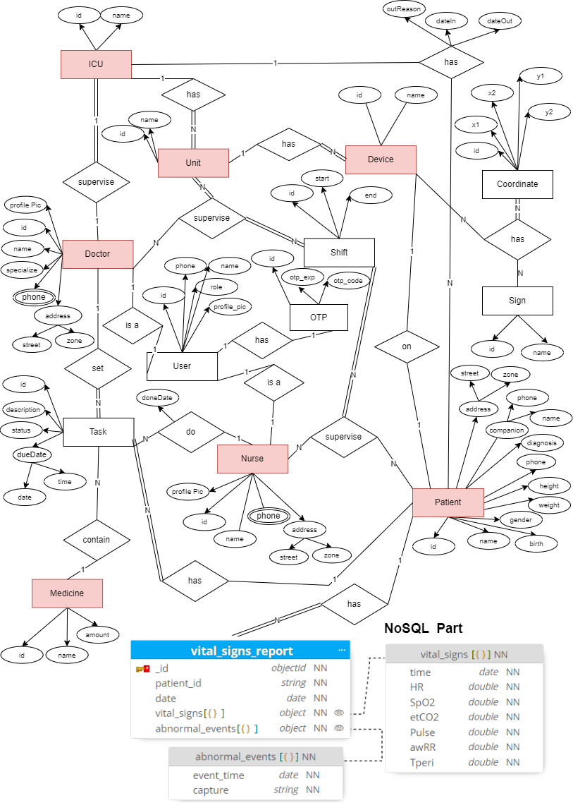
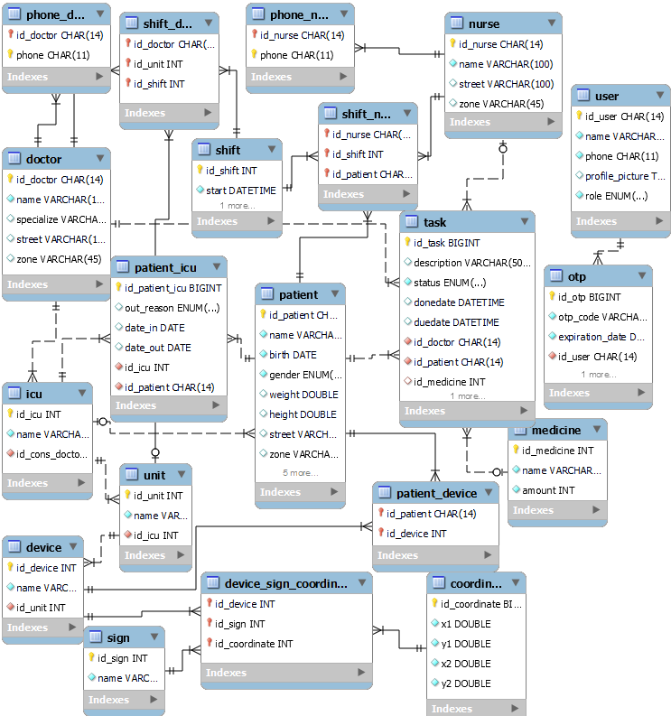

# VU ICU Management App - Data Base SubReadme
This document provides an in-depth look at the design and structure of the database used in the Vital Signs Management system.  

## Overview
When a *patient* is admitted to the *ICU, a nurse assigns them to a **monitoring device* that continuously tracks their vital signs. This real-time data is stored in the *VitalSignReport* table, capturing time-series data for ongoing analysis. The system automatically records vital signs and flags any abnormal events, such as spikes in heart rate or drops in oxygen saturation, which are stored in the *AbnormalEvents* entity.

*Shifts are* defined for both *Doctor* and *Nurse* roles. Doctors supervise specific *units, while nurses oversee individual patients. A consultant doctor manages the entire ICU. **Tasks* are assigned based on staff availability, with doctors able to delegate responsibilities to nurses during their shifts. To ensure timely medical intervention, doctors and nurses are notified of abnormal vital signs or emergencies in real time via the Notification entity, streamlining communication and response during critical situations.

Based on the entity identifying techniques (brainstorming with teammates and identifying nouns), here is the database documentation:  
🔗[DataBase Documentation](DataBase-mysql/database_documentation.doc)  

>⚠ Important Notice  
>In our ICU management system, we offer two main modes of operation:
>1. Standalone System:  
This mode is for scenarios where our system is implemented as the primary system in a hospital. In this case, we create all necessary tables such as patients, doctors, and nurses directly within our database.  
>2. Integration with Existing Systems:  
If the hospital already has an existing system, our system can integrate with it. In this mode, we link to the existing tables and data (like patients, doctors, and nurses) without duplicating them in our database.  

## Database Modifications and Enhancements
As part of the ongoing evolution of the ICU Management System, we have made several modifications to the original database design to meet new business requirements and optimize for performance. These changes have been driven by the need for efficient query execution, maintainability, and scalability.

**1. Transition to Hybrid SQL and NoSQL Architecture**  
- To handle both structured and high-volume unstructured data more effectively, we shifted from a purely relational database design to a combination of SQL (MySQL) and NoSQL (MongoDB):  
  We moved the handling of real-time vital signs and abnormal events to MongoDB for better scalability and flexibility    in managing time-series data and high-      frequency records.

**2. User Table Addition and Centralized Profile Management**  
- We introduced a centralized User table to manage common user attributes across all roles, simplifying user management and enhancing system efficiency.  
  The profile picture attribute, which was previously stored separately in the Doctor and Nurse tables, has been moved to the User table, reducing redundancy and     centralizing profile management for more efficient handling.

- In addition to basic user details, the User table now plays a key role in the authentication and OTP verification process.

**3. Normalization of Patient Data**  
- To optimize storage and prevent unnecessary data for patients not admitted to the ICU, we normalized the Patient table by separating ICU-related information into a new table.  
  The relationship between Patient and ICU was mapped into a new Patient_ICU table, which stores only the ICU-specific attributes such as id_icu, date_in,            date_out, and reason_out.
  
**4. Database Design**  
The following diagrams illustrate both the updated logical and physical database designs :

   
