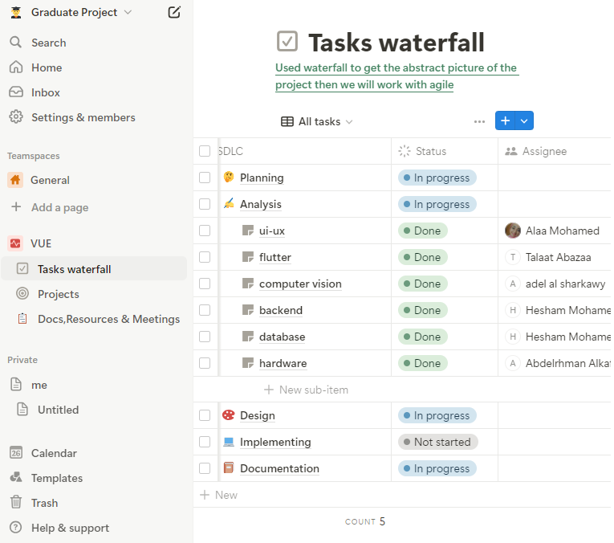

# VU ICU Management App

VU is a graduate project aimed at revolutionizing patient monitoring and healthcare delivery in intensive care units (ICUs). It enhances communication between healthcare teams, automates vital sign monitoring, and provides real-time access to patient data, empowering doctors and nurses to deliver high-quality care efficiently.
### Key Features and Goals
- :chart_with_upwards_trend: Real-time data streaming for continuous patient monitoring.
- :robot: Automated vital sign recording to reduce manual workload and errors.
- :file_folder: Electronic record-keeping for centralized and accessible patient information.
- :satellite: Remote monitoring capabilities to facilitate healthcare provider mobility.
### Technologies Used
- **Frontend**: Flutter
- **Backend**: Spring Boot
- **Database**: MySQL
- **Hardware**: ESP32-CAM  
- **Additional Technologies**: Computer vision algorithm

# 🔄 Software Development LifeCycle
## Planning (Project Beginnings)
#### First Team Meeting
The VU project started with our first team meeting, where we discussed the challenges faced by healthcare providers in ICUs. We conducted a thorough analysis to identify key pain points in patient monitoring and data management, aiming to understand the limitations of current ICU management and how our app could effectively address these challenges.
#### Initial Intuition and App Sequence (User Journey)
We brainstormed potential solutions and visualized our ideas on paper. We created rough sketches of the UI on paper .These sketches served as the first visual representation of our app, highlighting the essential features and layout.
- 🔗[View Figma Sketching Process](https://www.figma.com/board/ZQrooRtj2tLBjVQd0YZJbc/VUE-SDLC?node-id=0-1&t=mkKWM7DL2DmUfKcb-1)
#### SDLC Planning
We initiated the Software Development Life Cycle (SDLC) planning process, outlining phases and deliverables required to achieve our project goals and we distributed tasks among team members based on their expertise and roles
- 🔗

